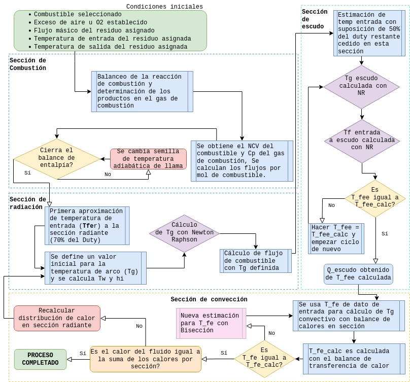

# Fire-Heater Simulator




## Running it locally

Make sure you have `node` installed and run this simulator with the following command in the terminal:

```sh
node . false SI 26.6667 50 0 20 1.01325e5
```

Arguments:

1. [boolean] Verbose logs at the console
1. [string] Unit System (SI)
1. [number] Ambient temperature (°C)
1. [number] Relative humidity (0-100%)
1. [number] O2 excess (0-30%) // if greater than possible or equal to 0, Air excess is used.
1. [number] Air excess (0-1000%) // overshadowed by O2 excess
1. [number] Ambient pressure (Pa)

## Data update

To update the data used in the simulator from the .csv table, run the following command:

```sh
npm run data
```

## Changing the algorithm web version

To update the files used by the web version of the app, run the following command:

```sh
npm start
```

## Example return

```json
{ "INFO": "Adiabatic flame temp: [2,111.555 K] 1,838.4 °C"}
{ "INFO": "duty_rad_dist: 62.40, ext_cycle_reps: 15"}
{ "DEFAULT": "RADI, T_in_calc: 378.5 °C, M_fuel: 2,073.530 kg/h, Tg_out: 799.0 °C"}
{ "DEFAULT": "SHLD, cycles: 8, T_in_calc: 370.1 °C, Tg_out: 694.3 °C"}
{ "DEFAULT": "CONV, T_in_calc: 358.9 °C, T_in_given: 358.9 °C, Tg_stack: 390.4 °C"}
{ "INFO": {
  "flows": {
    "total_flow": 21.814,
    "dry_total_flow": 19.272,
    "N2_%": 73.705,
    "H2O_%": 11.652,
    "CO2_%": 5.966,
    "O2_%": 8.678,
    "O2_mol_req_theor": 2.366,
    "O2_mass_req_theor": "0.076 kg",
    "air_excess_%": 80,
    "AC": 20.685,
    "AC_theor_dryAir": 11.295,
    "AC_mass": 28.034,
    "AC_mass_theor_moistAir": 15.574,
    "fuel_MW": "21.149 kg/kmol",
    "fuel_Cp": "42.409 kJ/kmol-K",
    "flue_MW": "28.149 kg/kmol",
    "flue_Cp_Tamb": "30.197 kJ/kmol-K",
    "NCV": "966864.235 kJ/mol"
    ...
  },
  "products": {
    "O2": 1.893,
    "H2O": 2.542,
    "CO2": 1.301,
    "SO2": 0,
    "N2": 16.078
  },
  "debug_data": {
    "atmPressure": "101.325 kPa",
    "ambTemperature": "26.667 °C",
    "humidity_%": 50,
    "dryAirN2_%": 79.05,
    "dryAirO2_%": 20.95,
    "dryAirPressure": "99.589 kPa",
    "waterPressure": "1.736 kPa",
    "H2OPressure_%": 1.714,
    "N2Pressure_%": 77.695,
    "O2Pressure_%": 20.591,
    "unitSystem": "SI"
  },
  "rad_result": {...},
  "shld_result": {...},
  "conv_result": {...}
}}
```

### Reference after processing the data

```m
20% exceso de aire 50% humedad
Moles de gas total y porcentajes por cada mol de combustible:
    "total_flow": 14.919,
    "dry_total_flow": 12.496,
    "N2_%": 71.86,
    "H2O_%": 16.245,
    "CO2_%": 8.723,
    "O2_%": 3.172,
    "O2_mol_req_theor": 2.366,
    "O2_mass_req_theor": "0.076 kg",
    "air_excess_%": 20,
    "AC": 13.79,
    "AC_mass": 18.689,
    "AC_mass_theor": 15.574,
    "fuel_MW": "21.149 kg/kmol",
    "fuel_Cp": "42.409 kJ/kmol-K",
    "flue_MW": "27.911 kg/kmol",
    "flue_Cp_Tamb": "30.613 kJ/kmol-K",
    "NCV": "966864.235 kJ/mol"
Moles de gases de combustion por cada mol de combustible
    "O2": 0.473,
    "H2O": 2.424,
    "CO2": 1.301,
    "SO2": 0,
    "N2": 10.721
Datos de entrada
    "atmPressure": "101.325 kPa",
    "ambTemperature": "26.667 °C",
    "humidity_%": 50,
    "dryAirN2_%": 79.05,
    "dryAirO2_%": 20.95,
    "dryAirPressure": "99.589 kPa",
    "waterPressure": "1.736 kPa",
    "H2OPressure_%": 1.714,
    "N2Pressure_%": 77.695,
    "O2Pressure_%": 20.591,
    "unitSystem": "SI"
```
